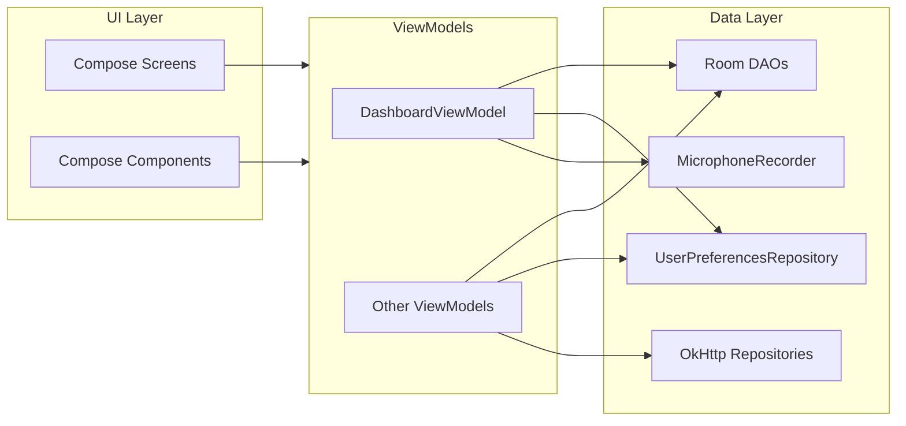

# SleepSense — Developer & Agent Guide

This document describes the **Android app** under `SleepSense/` as it exists in the repository today. Use it for onboarding, refactors, and AI-assisted work. When this guide conflicts with older marketing or feature notes, **trust the Kotlin sources and this file**.

Related docs (product / UX / sprint):

- [TODO_DEMO_SPRINT.md](TODO_DEMO_SPRINT.md) — demo priorities and acceptance criteria  
- [ux.md](ux.md) — screen wireframes and navigation map  
- [ui_recom.md](ui_recom.md) — visual polish recommendations (Claude + applied GPT pass)  
- [Features.md](Features.md) — high-level feature narrative (may lag the code; verify against this guide)

---

## 1. What SleepSense Is

SleepSense is a **Kotlin + Jetpack Compose** sleep companion app: onboarding, dashboard with score and trends, sleep history, habits and challenges, social stubs, steps, progress photos, AI chat and **weekly AI report** (HTTP to a Node backend), passive **foreground sleep tracking**, and **manual recording** with microphone level and simulated disturbances.

Hardware (ESP32) paths exist in data/model and Bluetooth-related code; the UI may show “ESP32 synced” style trust chips where demo polish was added—wire those to real connection state when integrating devices.

---

## 2. Repository Layout

| Path | Role |
|------|------|
| `SleepSense/app/` | Android application module |
| `SleepSense/app/src/main/java/com/circadianx/sleepsense/` | All Kotlin app code |
| `SleepSense/backend/` (if present in repo root) | Fastify server: `/report`, chat, etc. App talks to it via `BuildConfig.BACKEND_URL` |

---

## 3. Tech Stack (Verified)

| Area | Choice |
|------|--------|
| Language | Kotlin, JVM **17** |
| UI | Jetpack Compose, Material 3 |
| Min / compile / target SDK | **28 / 35 / 35** (`app/build.gradle.kts`) |
| DI | **Hilt** + KSP |
| DB | **Room** (`SleepSenseDatabase`, version **10**, `exportSchema = false`) |
| Preferences | **DataStore** (`AppModule` + `UserPreferences` keys) |
| HTTP | **OkHttp** + **Gson** (`ReportRepository`, `ChatRepository`) |
| Async | Coroutines, `StateFlow`, `collectAsStateWithLifecycle` |

Optional / supporting libraries include **Coil**, **CameraX**, **Health Connect**, **Vico** (declared in Gradle; some charts are **custom Canvas**—check the screen before assuming Vico).

---

## 4. Build, Run, and Configuration

### 4.1 Commands

From `SleepSense/`:

```bash
./gradlew :app:compileDebugKotlin
```

### 4.2 Backend URL

`BACKEND_URL` is injected at build time (default emulator host **`http://10.0.2.2:8080`**).

Override in `local.properties`:

```properties
BACKEND_URL=http://192.168.1.10:8080
```

Used as `BuildConfig.BACKEND_URL` in network repositories.

### 4.3 Maps API key

`MAPS_API_KEY` from `local.properties` or environment → `manifestPlaceholders` for Google Maps meta-data. Empty is allowed for CI; maps features need a real key.

### 4.4 Cleartext HTTP

`AndroidManifest.xml` sets `android:usesCleartextTraffic="true"` for local/dev servers. Tighten for production (HTTPS only, network security config).

---

## 5. Application Entry Points

| Component | File | Notes |
|-----------|------|------|
| `Application` | `SleepSenseApp.kt` | `@HiltAndroidApp`; creates notification channel `sleep_summary` |
| Single activity | `MainActivity.kt` | `@AndroidEntryPoint`; `enableEdgeToEdge()`; starts **`SleepTrackingService`** as foreground; hosts `SleepSenseNavGraph()` inside `SleepSenseTheme` |

---

## 6. Navigation

**Definition:** `navigation/NavGraph.kt` — `sealed class Screen` lists all routes.

**Bottom navigation (5 tabs):** Home (`Dashboard`), Sleep (`History`), Habits (`Habits`), Social (`Social`), Profile (`Settings`).

**Full-screen / stack routes (no bottom bar):** `Onboarding`, `Chat`, `Recording`, `Report`, plus `Challenges`, `Progress`, `Steps` reachable from Settings (and Habits → Challenges).

**Important:** `Recording` uses **`hiltViewModel(navController.getBackStackEntry(Screen.Dashboard.route))`** so `RecordingScreen` shares **`DashboardViewModel`** with `DashboardScreen` for recording state and `stopRecording()`.

**Onboarding shortcut:** `OnboardingScreen` reads `onboardingCompleted`; if true, `LaunchedEffect` calls `onFinished()` immediately so users skip the wizard. `NavHost` still **starts** at `Screen.Onboarding.route`.

---

## 7. Architecture Overview

High-level pattern: **UI (Compose) → ViewModel (`@HiltViewModel`) → Repository / DAO / DataStore / OkHttp**.



---

## 8. Package Map (`com.circadianx.sleepsense`)

| Package / area | Responsibility |
|----------------|----------------|
| `ui/screens/` | One composable per major screen (see §9) |
| `ui/components/` | Reusable UI: rings, charts, empty states, **premium visuals** |
| `ui/theme/` | `SleepSenseTheme`, colors, typography, spacing |
| `navigation/` | `SleepSenseNavGraph`, `Screen` routes |
| `viewmodel/` | Screen ViewModels (Hilt) |
| `presentation/onboarding/` | `OnboardingViewModel` (separate from `viewmodel/` package) |
| `data/db/` | `SleepSenseDatabase`, legacy `SleepSession` / `ApneaEvent` DAOs |
| `data/local/db/` | Entities + DAOs for sleep records, routines, steps, social, etc. |
| `data/network/` | `ReportRepository`, `ChatRepository`, DTOs |
| `data/preferences/` | DataStore keys (`UserPreferences`) |
| `data/seed/` | `DemoDataSeeder` — demo dataset for reviews |
| `data/audio/` | `MicrophoneRecorder` |
| `data/health/` | Health Connect integration |
| `data/bluetooth/` | Hardware packet types (used with recording pipeline) |
| `domain/` | `UserPreferencesRepository` interface, use cases, small domain models |
| `di/` | `AppModule` — Room, OkHttp, Gson, DataStore, Bluetooth adapter |
| `service/` | Foreground services, receivers, accessibility (see manifest for what is registered) |
| `util/` | Helpers (time, alarms, base64, etc.) |

---

## 9. Screens ↔ ViewModels ↔ Data (Quick Reference)

| Screen | ViewModel | Primary data / APIs |
|--------|-----------|---------------------|
| `OnboardingScreen` | `OnboardingViewModel` | DataStore: schedule, goals, onboarding flag |
| `DashboardScreen` | `DashboardViewModel` | `SleepRecordDao.observeRecent`, prefs schedule, `MicrophoneRecorder`, recording → insert `SleepRecordEntity` |
| `HistoryScreen` | `HistoryViewModel` | Sleep records, weekly bar data; `ModalBottomSheet` for session detail |
| `HabitsScreen` | `HabitsViewModel` | `RoutineDao` |
| `ChallengesScreen` | `ChallengesViewModel` | `ChallengeDao` |
| `StepsScreen` | (inline or local VM in file — check `StepsScreen.kt`) | `StepDao`, sparkline |
| `SocialScreen` | `SocialViewModel` | `SocialDao` |
| `ChatScreen` | `ChatViewModel` | `ChatRepository` → `POST {BACKEND_URL}/...` (see repository for path) |
| `ReportScreen` | `ReportViewModel` | `ReportRepository` → `POST /report`, reads last 14 nights + steps + goals + name |
| `RecordingScreen` | **Shared** `DashboardViewModel` | Mic dBFS, timer, disturbances, stop → persist |
| `SettingsScreen` | `SettingsViewModel` | Prefs, demo seed, toggles |
| `ProgressPhotosScreen` | `ProgressPhotosViewModel` | Camera + encrypted storage (`PhotoCipher`, `ProgressPhotoDao`) |

---

## 10. Persistence (Room)

**Database class:** `data/db/SleepSenseDatabase.kt`

- **Version:** 10  
- **Migrations:** `Room.databaseBuilder(...).fallbackToDestructiveMigration()` in `AppModule` — **any schema change wipes user data** on upgrade. For production, add proper migrations.

**Entity families (non-exhaustive; see `@Database entities =` for truth):**

- Sleep: `SleepRecordEntity`, `NightDisturbanceEntity`, plus legacy `SleepSession`, `ApneaEvent` (older pipeline)  
- Routines: `RoutineItemEntity`, `RoutineCompletionEntity`  
- Steps: `StepDayEntity`  
- Challenges: `ChallengeEntity`, check-ins, ratings  
- Social: `GroupChallengeEntity`, `GroupMemberEntity`, `StoryEntity`  
- Other: `AppBlockOverrideEntity`, `ProgressPhotoEntity`, …

**DAOs:** split between `data/db/*Dao.kt` (session/apnea) and `data/local/db/dao/*Dao.kt` (most feature tables).

---

## 11. Network Layer

| Repository | Endpoint (relative to `BACKEND_URL`) | Request / response |
|------------|--------------------------------------|-------------------|
| `ReportRepository` | **`POST /report`** | `ReportRequest` JSON → `ReportResponse` (weekly score, trend, patterns, risk, recommendations, highlights) |
| `ChatRepository` | **`POST /chat`**, **`GET /health`** | `ChatRequest` (question + structured context) → `ChatResponse.answer` |

Errors are surfaced in UI as user-readable strings (e.g. Report screen when server is down).

---

## 12. Background Behavior

| Component | Purpose |
|-----------|---------|
| `SleepTrackingService` | Foreground service (`dataSync`); screen on/off handling; passive sleep-related logging tied to prefs and DAOs |
| `StepCounterService` | Declared; **may be intentionally disabled** from `MainActivity` in some demo builds — confirm before assuming steps run in background |
| `BootReceiver` | Restarts / schedules work after boot (see implementation) |
| `RoutineReminderReceiver` | Routine alarms (`util/RoutineAlarmScheduler.kt`) |
| `AppBlockingAccessibilityService` | Optional app blocking after bedtime — requires user enabling accessibility; **verify manifest registration** if you rely on it in production |

---

## 13. UI System (Compose)

### 13.1 Theme

- **`SleepSenseTheme`** (`ui/theme/Theme.kt`) wraps Material 3 dark scheme + `SleepSenseColors` via `CompositionLocal` (`SleepSenseTheme.colors`).
- **Colors** — `ui/theme/Color.kt`: deep backgrounds, purple/blue accents, semantic greens/yellows/reds, sleep stage colors.
- **Typography** — `ui/theme/Type.kt`: DM Sans, DM Serif Display, JetBrains Mono.
- **Spacing** — `ui/theme/Spacing.kt`: `screenHorizontal`, card gaps, section gaps.

### 13.2 Reusable components (`ui/components/`)

| File | Role |
|------|------|
| `SsTopBar.kt` | App bar pattern |
| `SsScoreRing.kt` | Animated arc score ring; count-up; quality label |
| `SsSparkline.kt` | Gradient mini chart |
| `WeeklyBarChart.kt` | 7-day bar trend + trend badge |
| `StatCard.kt` | Metric card with optional delta line |
| `SsEmptyState.kt` | Icon + title + body + optional CTA |
| `AhiRingCard.kt` | Risk-style ring (AHI / recording states) |
| `AiInsightCard.kt` | Insight card pattern |
| `SectionHeader.kt` | Section titles |
| `SleepStageBar.kt` | Stage visualization |
| `PremiumVisuals.kt` | **PremiumSurface**, **TrustChip**, **NightTimelineStrip**, **AiReportLoadingSequence** — glassy gradient borders and demo “wow” visuals |

**Product rule (from UI recommendations):** treat **purple as jewelry**—reserve strong purple gradients for hero elements and CTAs so hierarchy stays “premium” not noisy.

---

## 14. Demo Data

**`DemoDataSeeder`** (`data/seed/DemoDataSeeder.kt`): inserts ~14 nights of sleep, steps, routines, challenges, social seed; sets bedtime schedule, goals, and `onboardingCompleted`.

**Trigger:** typically **Settings → About → “Load demo data”** (see `SettingsScreen` / `SettingsViewModel`).

Use this for **reviews, screenshots, and AI report demos** without real user nights.

---

## 15. Permissions (Manifest Summary)

Declared in `AndroidManifest.xml` (subset): `INTERNET`, `RECORD_AUDIO`, `POST_NOTIFICATIONS`, `FOREGROUND_SERVICE` (+ types), `ACTIVITY_RECOGNITION`, `CAMERA`, location, `RECEIVE_BOOT_COMPLETED`, `WAKE_LOCK`.

Runtime flows must request dangerous permissions where required (notifications, mic, activity recognition, camera, location).

---

## 16. Conventions for Future Changes

1. **New screen:** add `Screen` route → `NavHost` composable → `@HiltViewModel` + `ui/screens/YourScreen.kt`.  
2. **New persisted field:** add entity migration **or** accept destructive wipe during dev; plan real migrations before store release.  
3. **New API:** extend DTOs in `data/network/`, repository method, then ViewModel; keep JSON shapes aligned with `backend/`.  
4. **Shared recording state:** keep `RecordingScreen` on the **Dashboard** back stack entry ViewModel unless you introduce a dedicated recording scope.  
5. **UI consistency:** prefer extending `PremiumSurface` / existing components before inventing new card styles.

---

## 17. Suggested Improvement Backlog (for Agents)

High value, low ambiguity:

- **Nav start destination:** if onboarding complete, consider `startDestination = Dashboard` to avoid flash through Onboarding graph.  
- **Trust chips:** bind “ESP32 synced” / “14 nights analyzed” to **real** device connection and actual row counts.  
- **Report confidence:** derive from data volume (e.g. nights &lt; 7 → “medium”).  
- **Accessibility:** audit touch targets, labels on icon-only buttons, TalkBack for rings.  
- **StepCounterService:** document and unify whether steps run in demo vs production.  
- **Features.md:** refresh or add banner “verify against DEVELOPER_GUIDE.md”.

---

## 18. File Index — Kotlin Modules by Folder

Generated from current tree (adjust if you add files):

- **Screens (16):** `DashboardScreen`, `HistoryScreen`, `HabitsScreen`, `ChallengesScreen`, `StepsScreen`, `SocialScreen`, `ChatScreen`, `ReportScreen`, `RecordingScreen`, `SettingsScreen`, `OnboardingScreen`, `ProgressPhotosScreen`, …  
- **ViewModels (9):** `DashboardViewModel`, `HistoryViewModel`, `HabitsViewModel`, `ChallengesViewModel`, `SocialViewModel`, `ChatViewModel`, `ReportViewModel`, `SettingsViewModel`, `ProgressPhotosViewModel`  
- **Onboarding VM (1):** `presentation/onboarding/OnboardingViewModel`  
- **Network (2 repos):** `ChatRepository`, `ReportRepository`  
- **Seed (1):** `DemoDataSeeder`

For a full file list, search: `app/src/main/java/com/circadianx/sleepsense/**/*.kt`.

---

## 19. Contact / Ownership

Project context: embedded + mobile courseware under **CircadianX** naming. For external contributors, keep medical disclaimers honest (AI report is informational, not a diagnosis—see copy on `ReportScreen`).

---

*Last updated to match codebase layout and premium UI pass. Update this file when you add routes, entities, or backend contracts.*
